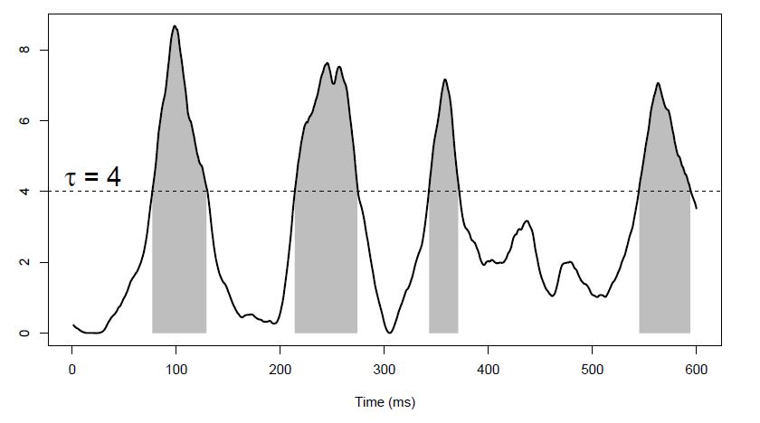

```{r, include = FALSE}
knitr::opts_chunk$set(
  collapse = TRUE,
  comment = "#>",
  fig.align = "center",
  echo = TRUE,
  warnings = FALSE,
  out.width = "500px",
  dpi=150
)
options(rmarkdown.html_vignette.check_title = FALSE)
```

We will see and apply in ``R`` the **permutation-based cluster-mass** method proposed by [Maris and Oostenveld, 2007](https://doi.org/10.1016/j.jneumeth.2007.03.024) and developed in the ``R`` package ``permuco4brain`` by [Frossard and Renaud, 2018](https://cran.r-project.org/web/packages/permuco/vignettes/permuco_tutorial.pdf), using electroencephalography (EEG) data. The cluster-mass is computed considering the following scenarios: 

- the time series of one channel: **temporal cluster-mass**; 
- the time series of multiple channels: **spatial-temporal cluster-mass**. 

Finally, the **All-Resolution Inference** (ARI) from [Rosenblatt et al. 2018](https://doi.org/10.1016/j.neuroimage.2018.07.060) is applied to compute the lower bound for the true discovery proportion (TDP) for the clusters found by the methods cited above. We will use the ``ARIeeg`` and ``hommel`` ``R`` packages here.

## Packages

First of all, you need to install and load the following packages:

```{r 1, warning=FALSE,message=FALSE}
rm(list = ls())
#remotes::install_github("angeella/ARIeeg")
#remotes::install_github("jaromilfrossard/permuco4brain")
#remotes::install_github("jaromilfrossard/permuco")
library(ARIeeg) #to compute ARI for spatial-temporal clusters
library(permuco4brain) #to compute the spatial-temporal clusters
library(plotly) # to create interactive plots (optional)
library(tidyverse) #collection of R packages (e.g., ggplot2, dplyr)
library(permuco) #to compute the temporal clusters
library(hommel) #to compute ARI for temporal clusters
```

## Data

We analyze the dataset from the ```ARIeeg``` package which is an **Event-Related Potential (ERP) experiment** composed of:

- 20 Subjects;
- 32 Channels;
- Stimuli: pictures of
    1. (f): fear face;
    2. (h): happiness face;
    3. (d): disgusted face;
    4. (n): neutral face;
    5. (o): object.

$500$ time points of brain signals are recorded for each subject and stimuli.

You can load the data using the following command:

```{r 2}
load(system.file("extdata", "data_eeg_emotion.RData", package = "ARIeeg"))
```

Let's see how the structure of the dataset:

```{r}
str(dati)
```

It is a list (`eeg_data` class object from `eegUtils` package) composed of `r length(dati)` objects (the `reference` one is `NULL`). The `eegUtils` package permits to preprocess and plot EEG data. More information [here](https://craddm.github.io/eegUtils/articles/eegUtils.html). So, we have:

1. `signals`: `tibble` object, i.e., data frame composed by $50000$ observations (**brain signals** across $500$ time points for $100 = 5 \times 20$ stimulus-subject combinations) and $32$ variables (channels);

2. `srate`: a single numeric value giving the **sampling rate** of the data in Hz. In this case, the signal includes $500$ different time points;

3. `events`: `tibble` object composed of $100$ observations, i.e., **experiment design** ($5$ stimuli for each subject, $100 = 5 \times 20$) and $6$ variables (event onset in samples, events time in seconds, id stimulus, epoch, id time, id subject);

4. `chan_info`: `tibble` object composed by $32$ observations (**channels**) and $9$ variables (name of electrode, Cartesian 3D coordinates etc);

5. `timings`: `tibble` object containing a description of each row in time (s) and sample numbers (samples). We have in this case $50000 = 100 \times 500$ rows, $100 = 5 \times 20$ epochs (one for each combination stimuli-subjects), $500$ different time points;

6. `epoch`: containing information about the data epochs (not relevant for this analysis).

### EDA

We drop off the final five *bad* channels (electrode locations are missing) and select two conditions, i.e., **disgust face** (number $3$) and **object** (number $5$): 

```{r 4}
m <- nrow(dati$chan_info)
chans <- dati$chan_info$electrode[c(1:(m-5))]
dati <- 
  dati %>%
  eegUtils::select_elecs(chans)%>% 
  eegUtils::select_epochs(epoch_events = c(3,5))
```


Let's plot the **global mean** of the signal under the two selected conditions in the channels Fp1, Fp2, F3, and F4.

The observations in `signals` are stacked considering the following structure (first subject, then stimuli, then time):

```{r, echo = FALSE}
knitr::kable(head(data.frame(SUBJECT = rep(seq(20), 500*2),
                        STIMULI = rep(c("3","5"), each = 500*20),
                        TIME = rep(seq(500), 20*2))))
```


```{r}
chans <- c("Fp1", "Fp2", "F3", "F4")

dati_sel <- dati %>%
    eegUtils::select_elecs(chans)

dati_sel$signals$subj <- rep(seq(20), 500*2)
dati_sel$signals$condition <- rep(c("3","5"), each = 500*20)
dati_sel$signals$time <- rep(seq(500), 20*2)

A<-dati_sel$signals %>% 
  pivot_longer(cols = all_of(chans)) %>%
ggplot(aes(x = time, y = value)) +
  geom_line(aes(group = condition))  +
  stat_summary(
    fun = "mean", geom = "line", alpha = 1, linewidth = 1,
    aes(color = condition),show.legend = TRUE
  ) +
  geom_vline(xintercept = 0, linetype = "dashed") +
  geom_vline(xintercept = .17, linetype = "dotted") +
  theme(legend.position = "bottom")+
  scale_color_manual(labels = c("Disgust", "Object"), 
                     values = c("#80bfff", "#ff8080"))+
  facet_wrap(~name)
A
```

if you want an interactive plot, you can use the function ``ggplotly`` from the package ``plotly``:

```{r, warning=FALSE}
plotly::ggplotly(A)    
```


## Theory

### Multiple testing problem?

The aim is to test if the difference in brain signal during the two conditions differs from $0$ for each time point, i.e., $500$. If the complete set of channels is considered, we also have tests for each channel, i.e., $27$, returning a total number of tests equals $500 \cdot 27$. Therefore, we have $500$ or $500 \cdot 27$ statistical tests to perform at group-level, so considering the **random subject effect**.

We must deal with multiple statistical tests, and standard family-wise error rate (FWER) correction methods such as Bonferroni do not capture the time(-spatial) correlation structure of the statistical tests; it will be a conservative method.

The cluster mass method proposed by [Maris and Oostenveld, 2007](https://doi.org/10.1016/j.jneumeth.2007.03.024) is then used. It is based on **permutation theory**; it gains some power with respect to other procedures **correcting at the (spatial-)temporal cluster level** instead of at the level of single tests. 

It is similar to the cluster mass approach in the fMRI framework, but in this case, the *voxels*, i.e., the single object of the analysis, are expressed in terms of time points or combination time points/channels. The method can then gain some power with respect to some traditional conservative FWER correction methods exploiting the (spatial-)temporal structure of the data.

So, let's see how to compute the statistical tests.


### Repeated Measures ANOVA Model

The cluster mass method is based on the **repeated measures ANOVA** model, i.e.,

$$
\boxed{y = \mathbf{1} \mu +  X_{\eta} \eta  +  X_{\pi}\pi +   X_{\gamma}\gamma + \epsilon}
$$

where $\mathbf{1}$ is a matrix of ones having dimensions $N \times 1$ and

  1. $y \in \mathbb{R}^{N \times 1}$ is the response variables, i.e., the **signal**, in our case $N = n_{\text{subj}} \times n_{\text{stimuli}} = 40$;
  
  2. $\mu$ is the **intercept**;
  
  3. $X_{\eta} \in \mathbb{R}^{N \times n_{\text{stimuli}}}$ is the **design matrix** describing the **fixed effect** regarding the stimuli, and $\eta \in \mathbb{R}^{n_{\text{stimuli}} \times 1}$ the corresponding parameter of interest;
  
  4. $X_{\pi} \in \mathbb{R}^{N \times n_{\text{subj}}}$ is the **design matrix** describing the **random effect** regarding the subjects, and $\pi \in \mathbb{R}^{n_{\text{subj}} \times 1}$ the corresponding subject effect.
  
  5. $X_{\gamma}  \in \mathbb{R}^{N \times (n_{\text{subj}} n_{\text{stimuli}})}$ is the **design matrix** describing the **interaction effects** between subjects and conditions, and $\gamma \in \mathbb{R}^{(n_{\text{subj}} n_{\text{stimuli}}) \times 1}$ the corresponding interaction effect;
  
  6. $\epsilon \in \mathbb{R}^{N \times 1}$ is the **error term** with $0$ mean and variance $\sigma^2 I_N$.

Therefore, $y \sim (1\mu + X_{\eta} \eta, \Sigma)$, $\pi \sim (0, \Sigma_{\pi})$ and $\gamma \sim (0,\Sigma_{\gamma})$. Generally, $\Sigma_{\pi} = \sigma^2_{\pi} I_{n_{subj}}$ and the sigma-restriction constraints are assumed.

We want to make inference on $\eta$, such that $H_0: \eta = 0$ vs $H_1: \eta \ne 0$. We do that using the **F statistic**, i.e.,

$$
F = \dfrac{y^\top H_{X_{\eta}} y / (n_{\text{stimuli}} - 1)}{ y^\top H_{X_{\gamma}}y/(n_{\text{stimuli}} -1)(n_{\text{subj}} -1)} 
$$
where $H_{X}$ is the **projection matrix** of $X$, i.e., $H_{X} = X(X^\top X)^{-1} X^\top$. In order to compute this test, we use an alternative definition of $F$ based on the residuals:

$$
F_r = \dfrac{r^\top H_{X_{\eta}} r / (n_{\text{stimuli}} - 1)}{ r^\top H_{X_{\gamma}}r/(n_{\text{stimuli}} -1)(n_{\text{subj}} -1)} 
$$

where $r = (H_{X_{\eta}} + H_{X_{\gamma}})y$. For further details, see [Kherad Pajouh and Renaud, 2014](https://link.springer.com/article/10.1007/s00362-014-0617-3).

So, let the group of permutation, including the identity transformation, $\mathcal{P}$, we use $r^\star = P r$, where $P \in \mathcal{P}$ to compute the null distribution of our test, i.e., $\mathcal{R}$, and then the $p$-value, i.e.,

$$
\text{$p$-value} = \dfrac{1}{B} \sum_{F^\star_r \in \mathcal{R}} \mathbb{I}(|F^\star_r| \ge |F_r|)
$$

if the two-tailed is considered, where $F^\star_r = f(r^\star)$.

We have this model for each time point $t \in \{1, \dots, 500\}$ and each channel, so finally we will have $n_{\text{time-points}} \times n_{\text{channels}}$ statistical tests/$p$-values (raw).

### Temporal Cluster mass

This method has been proposed by [Maris and Oostenveld, 2007](https://doi.org/10.1016/j.jneumeth.2007.03.024). It assumes that an effect will appear in clusters of adjacent time frames. Having statistics for each time point, we form these clusters using a threshold $\tau$ as follows:


```{r, echo=FALSE, fig.cap= "Example of cluster mass EEG from Frossard 2019"}

```


All contiguous time points with statistics above this threshold define a single cluster $C_i$ with $i \in \{1, \dots, n_C\}$, where $n_C$ is the number of clusters found. 

For each time point in the same cluster $C_i$, we assign the same cluster mass statistic $m_i = f(C_i)$, where $f$ is the function that summarizes the statistics of the entire cluster. 

Typically, it is the sum of the $F$ statistics. The null distribution of the cluster mass $\mathcal{M}$ is computed by iterating the above process for each permutation. 

The contribution of a permutation to the cluster-mass null distribution is the maximum overall cluster masses of that permutation. So for each $P \in \mathcal{P}$:

- compute the $n_{\text{time-points}}$ permuted statistics
- Find the $n_C^\star$ clusters $C_i^\star$ considering the same threshold $\tau$
- Compute $m_i^\star = f(C_i^\star)$
- Find the maximum over $i = \{1, \dots, n_C^\star\}$

To check the significance of the cluster $C_i$ of interest, we compare the observed cluster mass $m_i = f(C_i)$ with the cluster mass null distribution $\mathcal{M}$. Therefore, for each cluster $C_i$, we have the associated $p$-values computed as

$$
p_i = \dfrac{1}{n_P} \sum_{m^\star \in \mathcal{M}} I\{m^\star  \ge m_i\}
$$

where $m^\star \in \mathcal{M}$ is then calculated given permutation statistics. 

This method makes sense when analyzing EEG data because if a difference in brain activity is thought to occur at time $s$ for a given factor, then it is very likely that this difference will also occur at time $s + 1$ (or $s - 1$).

### Spatial-temporal Cluster mass 

In this case, we use **graph theory**, where the vertices represent the channels and the edges represent the **adjacency relationships** between two channels.

The adjacency must be defined using prior information, so the three-dimensional Euclidean distance between channels is used. Two channels are defined as adjacent if their Euclidean distance is less than the threshold $\delta$, where $\delta$ is the smallest Euclidean distance that yields a connected graph [Cheval, et al., 2018 ](https://www.sciencedirect.com/science/article/pii/S0028393218303981?casa_token=WZEwrKRyNWkAAAAA:tYPdd5QarUoc8ErySnlzcPgr7c3naUjct62Uv5Cf3Dh4t6RsszLN26hIncUSZGHV82pInzcFSQ)). 

This follows from the fact that there is no unconnected subgraph for a connected graph. The existence of subgraphs implies that some tests cannot be entered in the same cluster, which is not a reasonable assumption for the present analysis ([Frossard and Renaud, 2018](https://cran.r-project.org/web/packages/permuco/vignettes/permuco_tutorial.pdf); [Frossard, 2019](10.13097/archive-ouverte/unige:125617)).

Once we have a definition of **spatial contiguity**, we need to define temporal contiguity. We reproduce this graph $n_{\text{time-points}}$ times, and we have edges between pairs of two vertices associated **with the same electrode if they are temporally adjacent**. 

The final graph has a total number of vertices, i.e., the number of tests, equals ($n_{\text{channels}} \times n_{\text{time-points}}$). The following figure shows an example with $64$ channels and $3$ time measures:


```{r, echo=FALSE, fig.cap= "Example of graph of adjacency from Frossard 2019"}
knitr::include_graphics("../vignettes/Image/cluster.JPG")
```

We compute for each spatial-temporal cluster the cluster-mass statistic as before. We then delete all the vertices in which statistics are below a threshold, e.g., the $95$ percentile of the null distribution of the $F$ statistics. So, we have a new graph composed of **multiple connected components**, where each connected component defines the spatial-temporal cluster. 

The cluster-mass null distribution is calculated using permutations that preserve the spatial-temporal correlation structure of the statistical tests, i.e., no changing the position of the electrodes and mixing the time points.

We will construct a three-dimensional array, where the first dimension represents the design of our experiments (subjects of $\times$ stimuli), the second one the time points, and the third one the electrodes. 

So, we apply permutations only in the first dimension using the method proposed by [Kherad Pajouh and Renaud, 2014](https://link.springer.com/article/10.1007/s00362-014-0617-3). 

## Application

In `R`, all of this is possible thanks to the ``permuco`` and ``permuco4brain`` packages developed by [Frossard and Renaud, 2018](https://cran.r-project.org/web/packages/permuco/vignettes/permuco_tutorial.pdf).

### Temporal Cluster-Mass

So, we select one channel from our dataset, e.g., the **Fp1**:

```{r}
Fp1 <- dati %>% select(Fp1)
```

1. Construct the $y$. We need to construct the two-dimensional **signal matrix**, having dimensions $40 \times 500$:

```{r}
Fp1<-dati %>%
  eegUtils::select_elecs("Fp1")%>% 
  eegUtils::select_epochs(epoch_events = c(3,5))

signal_Fp1 <- matrix(Fp1$signals$Fp1, 
              nrow = 40,
              byrow = TRUE) #remember the structure of the signals tibble
dim(signal_Fp1)
```

So, ``signal_Fp1`` is a data frame that expresses the signals recorded in the **Fp1** channel under the two conditions across $500$ time points for $20$ subjects.

2. Construct the matrix containing the covariates information (i.e., subject and conditions), having dimensions $40 \times 2$:

```{r}
design <- 
  data.frame(participant_id =rep(seq(20), 2),
             condition =rep(c(3,5), 20)) #as in Fp1
dim(design)
```

3. Define the **repeated measures ANOVA formula**: 

```{r}
f <- signal_Fp1 ~ condition + Error(participant_id/(condition))
```

In the formula, we need to specify the ``Error(.)`` term since we are dealing with a repeated measures design. We specify a subject-level random effect and a condition fixed effect nested within subjects.

Thanks to the ``permuco`` package, we can apply the temporal cluster-mass for the channel **Fp1**:

```{r}
lm_Fp1 <- clusterlm(f,data = design)
summary(lm_Fp1)
```

Here we can see:

- The threshold used to construct the temporal clusters, i.e., `r lm_Fp1$threshold` ($0.95$ quantile of the test statistic);

- The type of cluster mass function, i.e., the sum of single statistical tests time contiguous; 

- When the cluster starts and ends, the value of the cluster mass and the associated corrected $p$-values.

For example, considering the significant cluster (i.e., 2), we can compute the cluster mass as:

```{r}
sum(lm_Fp1$multiple_comparison$condition$uncorrected$main[c(167:212), "statistic"])
```


We can also plot the temporal clusters:

```{r}
plot(lm_Fp1)
```

The red dots represent the significant temporal cluster for the channel **Fp1** composed of the time points from $167$ to $212$ using a threshold equal to `r lm_Fp1$threshold`. 

#### ARI in EEG cluster mass

However, our significant cluster says only that at least one test is different from $0$, we don't know how many tests/time-points are significant (**spatial specificity paradox**). 

So, we can apply ARI to understand the lower bound of the number of true discovery proportions. The cluster comprises the time points from $167$ to $212$, i.e., the cluster size equals $46$.

```{r}
praw <- lm_Fp1$multiple_comparison$condition$uncorrected$main[,2] #extract raw pvalues


output_lm <- summary(lm_Fp1)$condition

TDP <- sapply(seq(nrow(output_lm)), function(x){ 
  
  ix <- c(output_lm$start[x]:output_lm$end[x]) #set of indices hyp of interest
  
  round(discoveries(hommel(praw), ix = ix)/length(ix),3) #apply parametric ARI
  }
)

data.frame(clustermass = output_lm$`cluster mass`,
          pmass = output_lm$`P(>mass)`,
          TDP = TDP)
```

Therefore, the second cluster has at least `r TDP[2]*100`$\%$ true active time points. 

### Spatial-Temporal Cluster-Mass

1. Construct the $y$. We need to construct the three-dimensional **signal array**, having dimensions $40 \times 500 \times 27$:

```{r}
signal <- array(NA, dim = c(40,500, 27))

chn <- eegUtils::channel_names(dati)[1:27]

for(i in seq(27)){
  chn_utils<-dati %>%
  eegUtils::select_elecs(chn[i])%>% 
  eegUtils::select_epochs(epoch_events = c(3,5))

signal[,,i] <- matrix(as.data.frame(chn_utils$signals)[,1], 
              nrow = 40,
              byrow = TRUE)
}
dimnames(signal) <- list(NULL, NULL, chn)

```


2. Construct as before the matrix containing the covariates information having dimensions $40 \times 2$:

```{r 8}
design <- 
  data.frame(participant_id =rep(seq(20), 2),
             condition =rep(c(3,5), 20)) #as before
dim(design)
```

3. Construct the **graph**, using $\delta = 53mm$ (the maximal distance for adjacency of two channels) and the function ``position_to_graph`` from the ``permuco4brain`` package:

```{r fig.align="center"}
graph <- position_to_graph(as.data.frame(dati$chan_info)[c(1:27),], 
                           name = "electrode", 
                           delta = 53,
                           x = "cart_x", 
                           y = "cart_y", 
                           z = "cart_z")
graph
```

The object `graph` is an `igraph` object that computes the channels' adjacency matrix. You can see two letters `UN--` that stand for unweighted undirected named graph. The graph comprises $27$ nodes (i.e., channels) and $48$ edges.

```{r}
plot(graph)
```

How do you choose $\delta$? I simply increased the value of $\delta$ until the `position_to_graph` function returns the following warning:

`Warning: This graph has more than 1 cluster. It is not valid for a clustermass test. Check the position of the channels or increase delta.`

4. Define the **repeated measures ANOVA formula**: 

```{r 10}
f <- signal ~ condition + Error(participant_id/(condition))
```

Finally, run the main function:

```{r}
model <- permuco4brain::brainperm(formula = f,
                                  data = design,
                                  graph = graph,
                                  np = 1000,
                                  multcomp = "clustermass",
                                  return_distribution = TRUE)
```

where `np` indicates the number of permutation.

Then, we can analyze the output:

```{r}
print(model)
```

We have only two significant clusters. The first comprises $25$ channels while the second is $8$ channels, with main channels P7. You can see in detail the components of this cluster in

```{r}
cls17 <- names(model$multiple_comparison$condition$clustermass$cluster$membership[which(as.vector(model$multiple_comparison$condition$clustermass$cluster$membership)==17)])
head(cls17,n = 10)
```

You can see the significant cluster (in red) at fixed time points (e.g. 300) using plot:

```{r}
plot(model, samples = 300)
```

in fact:

```{r}
cls17[grepl("300", cls17)]
```


and the significant cluster over time and over channels using:

```{r}
image(model)
```

where the significant clusters are represented in a colour-scale (as a function of the individual statistics) and the non-significant one in grey. The white pixels are tests which statistic are below the threshold.

#### ARI in EEG spatial-temporal cluster analysis

However, our significant clusters say again that at least one combination channels/time-points is different from $0$ as before, we do not know how many combinations are significant (**spatial specificity paradox**). 

So, we can apply ARI to understand the lower bound of the number of true discovery proportion:

```{r}
ARIeeg::ARIeeg(model = model, alpha = 0.4)
```

In this case, the lower bound for TDP equals $0$ for all clusters, also if we consider the significant spatial-temporal clusters. 

**Why is that?**

ARI is based on the Simes inequality to construct the critical vector that computes the lower bound for the TDP for the set $S$ of hypotheses (i.e., $\bar{a}(S)$).

Therefore, the approach can be conservative under strong positive dependence among tests $\rightarrow$ **permutation-based ARI** ([Andreella et al. 2023](https://onlinelibrary.wiley.com/doi/full/10.1002/sim.9725)).

Recalling the definition of $\bar{a}$:

$$\bar{a}(S) = \max_{1 \le u \le |S|} 1 - u + |\{i \in S, p_i \le l_u\}|$$

where $S$ is the set of hypothesis of interest (i.e., cluster), $p_i$ is the raw p-values and $l_i$ a suitable vector such that 

$$\Pr(\cap_{i = 1}^{|N|} \{q_{(i)} \ge l_i\}) \le 1-\alpha$$

where $N$ is the unknown set of inactive time-points/channels and $q_{(i)}$ are their
sorted $p$-values. In other words, the curve of the sorted $p$-values corresponding to inactive time-points/channels should lie completely above the $l_i$ with probability at least $1 − \alpha$.

paramteric ARI uses $l_i = \dfrac{i \alpha}{m}$, where $m$ is the total number of statistical tests. 

To gain power in case of dependence between tests, we can consider $l_i = \dfrac{i \lambda_{\alpha}}{m}$ and calibrate $\lambda_{\alpha}$ using the $p$-values permutation null distribution such that $l_i$ cuts the $p$-values null distribution to have the $\alpha \%$ $p$-values distribution below it (i.e., it is a proper critical vector).


```{r}
alpha <- 0.4
Test <- model$multiple_comparison$condition$uncorrected$distribution
dim(Test) <- c(dim(Test)[1], dim(Test)[2]*dim(Test)[3])

pv <- matrixStats::colRanks(-abs(Test)) / nrow(Test)

lambda <- pARI::lambdaOpt(pvalues = pv, 
                          family = "simes", 
                          alpha = 0.3) #compute lambda

cvOpt = pARI::criticalVector(pvalues = pv, 
                             family = "simes", 
                             lambda = lambda, 
                             alpha = 0.3) #compute l_i

plot(sort(pv[,1]), type = "l")
for(i in seq(ncol(pv))){
  
  lines(sort(pv[,i])) #plot null distribution
  
}
lines(sort(pv[,1]), col = "red") #plot observed sorted p-values
lines(cvOpt, col = "blue") #plot l_i pARI
lines((c(1:nrow(pv))*alpha)/nrow(pv), col = "green") #plot l_i ARI

```

Since $\lambda_{\alpha} > \alpha$ the permutation approach will outperfom ARI:

```{r}
ARIeeg::ARIpermEEG(model = model, family = "simes", alpha = 0.4)
```


# References

 - Maris, E., & Oostenveld, R. (2007). Nonparametric statistical testing of EEG-and MEG-data. Journal of neuroscience methods, 164(1), 177-190.

 - Kherad-Pajouh, S., & Renaud, O. (2015). A general permutation approach for analyzing repeated measures ANOVA and mixed-model designs. Statistical Papers, 56(4), 947-967.
 
 - Frossard, J. (2019). Permutation tests and multiple comparisons in the linear models and mixed linear models, with extension to experiments using electroencephalography. DOI: 10.13097/archive-ouverte/unige:125617.
 
 - Frossard, J. & O. Renaud (2018). Permuco: Permutation Tests for Regression, (Repeated Measures) ANOVA/ANCOVA and Comparison of Signals. R Packages.
 
- Cheval, Boris, et al. "Avoiding sedentary behaviors requires more cortical resources than avoiding physical activity: An EEG study." Neuropsychologia 119 (2018): 68-80.

- Rosenblatt JD, Finos L, Weeda WD, Solari A, Goeman JJ. All-Resolutions Inference for brain imaging. Neuroimage. 2018 Nov 1;181:786-796. doi: 10.1016/j.neuroimage.2018.07.060. Epub 2018 Jul 27. PMID: 30056198.

- Andreella, A, Hemerik, J, Finos, L, Weeda, W, Goeman, J. Permutation-based true discovery proportions for functional magnetic resonance imaging cluster analysis. Statistics in Medicine. 2023; 1- 30. doi: 10.1002/sim.9725

- https://jaromilfrossard.netlify.app/post/2018-08-06-full-scalp-cluster-mass-test-for-eeg/
